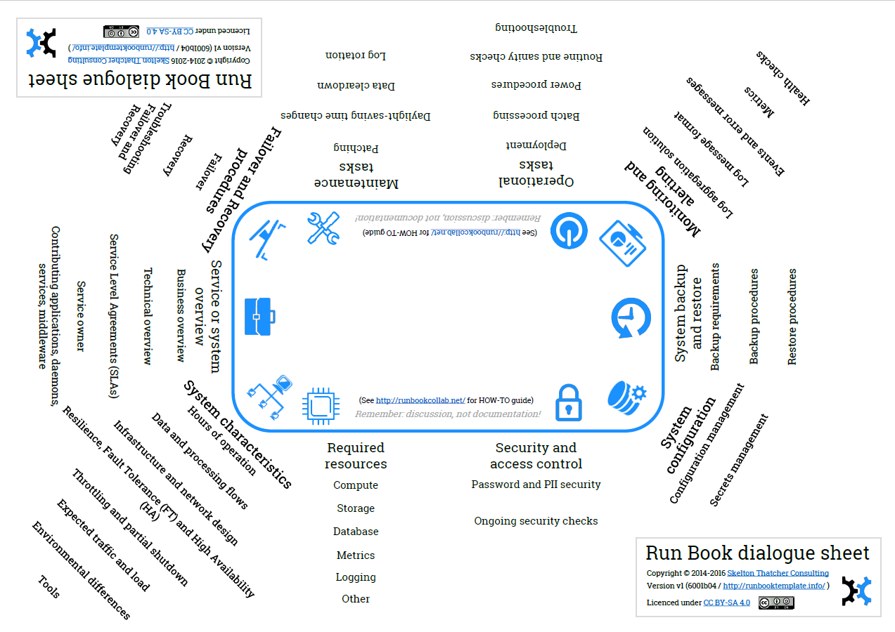
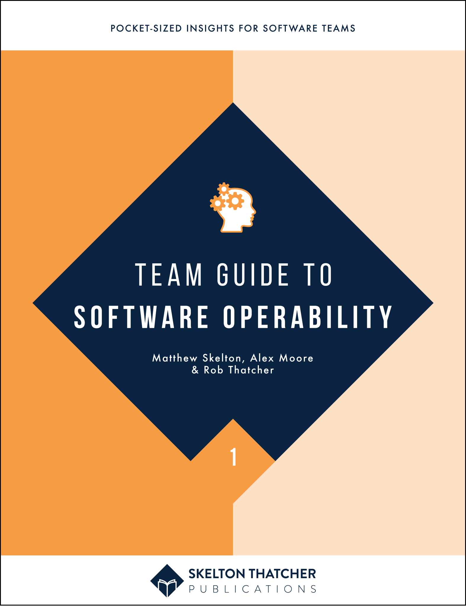

# Run Book Template

A Run Book / Operations Manual template for modern software systems.

There are two main files:

1. [`run-book-template.md`](run-book-template.md) - the template itself (see below)
2. The [Run Book Dialogue Sheet](https://github.com/SkeltonThatcher/run-book-template/releases/latest), a PDF (300KB) with headings taken from the `run-book-template.md` and designed to be printed at A1 paper size for use in a team situation. _The Run Book Dialogue Sheet is based on the work on [Dialogue Sheets by Allan Kelly](https://www.infoq.com/articles/dialogue-sheets-retrospectives) and used with his permission._

## Overview

The file `run-book-template.md` contains suggested checks and procedures for most non-trivial software systems that can be used as **a template to create a Run Book or System Operation Manual** (SOM). Treat the resulting information as a starting point for discussions about operational readiness. 

In our experience, most interesting software systems will need engineers to address the majority of the points, if only to confirm that "this section definitely does not apply here" - a valuable realisation. Each section has a description to set the context and explain why it's needed. 

You'll likely get the best outcomes from having the **software development team own and drive the activities around the Run Book**, seeking input from Testers and Ops people to fill in gaps in knowledge. In practice, you'll want to automate many of the checks and procedures (rather than leaving them in a wiki), but remember: _discussion, not documentation_ is where the value lives in Run Book collaboration!  See [runbookcollab.info](http://runbookcollab.info/) for more details.

Have fun! _Matthew Skelton & Rob Thatcher_

> The book [Team Guide to Software Operability](http://operabilitybook.com/) has a chapter dedicated to the use of Run Book collaboration and the Run Book dialogue sheet, including details of how different teams use these techniques. 
>   
> 

Copyright © 2014-2016 [Skelton Thatcher Consulting](https://skeltonthatcher.com/)

Licenced under [CC BY-SA 4.0](https://creativecommons.org/licenses/by-sa/4.0/) 

##  How to use the template

1. Fork the repo
1. Edit the file [`run-book-template.md`](run-book-template.md) 
1. Add your own operational & runtime checks - send us a Pull Request if you think your new checks are useful to others!
1. Remove (or comment with _N/A_) those sections that really do not apply in your case (but double-check first).
1. Use the template as a way to [encourage discussion and collaboration between Devs and Ops people for building better systems](http://runbookcollab.info/).
1. If some information is missing for one or more sections, indicate this clearly (e.g. *WARNING*). Knowing what you do not know is valuable.
1. After you have validated the operational aspects with all teams involved, begin to automate the checks and procedures.

**Expect to redesign parts of the software in order to better meet the operational needs outlined in this template!**

